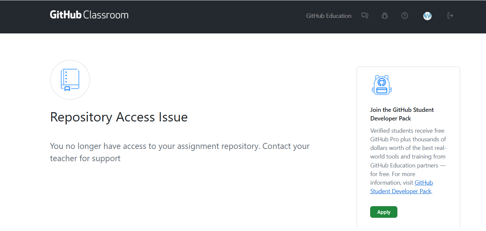

# Troubleshooting
This page contains FAQ and troubleshooting info for all assignments in the course.

## Problem: running scripts is disabled on this system

When activating the virtual environment, I get the following bug:

```
...cannot be loaded because running scripts is disabled on this system. For more information, see about_Execution_Policies at https:/go.microsoft.com/fwlink/?LinkID=135170.
```

 ***Solution***
Start Windows PowerShell with the "Run as Administrator" option. Only members of the Administrators group on the computer can change the execution policy.

Enable running unsigned scripts by entering:

```
set-executionpolicy remotesigned
```

This will allow running unsigned scripts that you write on your local computer and signed scripts from Internet. This will change the policy permanently.

## Problem: Creating a virtual environment does not work

In case `python -m venv myenv` does not work, `py -m venv myenv` may work

## Problem: `pytest` command does not work.

You may try: `python -m pytest`.

## Problem 'python' is not recognized as an internal or external command

Probably Python is not installed. You can install python via the install manager: [https://www.python.org/downloads/release/pymanager-261/](https://www.python.org/downloads/release/pymanager-261/).

## Problem: Jupyter Notebook Kernel Not Found

If the cells in the Jupyter notebook do not execute, you may need to specify the Python kernel. Follow these steps:

Windows
1. Click on the "Select Kernel" button in the top-right corner of the notebook (it may show "Python 3.x" or similar)
2. From the dropdown menu, select "Python Environments"
3. If your virtual environment (myenv) is not listed, click "Enter interpreter path"
4. Navigate to the virtual environment you created, select: myenv\Scripts\python.exe
5. The notebook will now use the correct Python interpreter from your virtual environment

Mac/Linux
1. Click on the "Select Kernel" button in the top-right corner of the notebook
2. From the dropdown menu, select "Python Environments"
3. If your virtual environment (myenv) is not listed, click "Enter interpreter path"
4. Navigate to the virtual environment you created, select: myenv/bin/python
5. The notebook will now use the correct Python interpreter from your virtual environment

## Problem: Repository access issue

After accepting the assignment invitation link, I want to open my repository, but I get the error shown below.



If this happens, check your mailbox. You have received an automatically generated email from `github-classroom[bot]` with an invitation. Click "view invitation" and accept the invite. After that, you should have access to the repo.